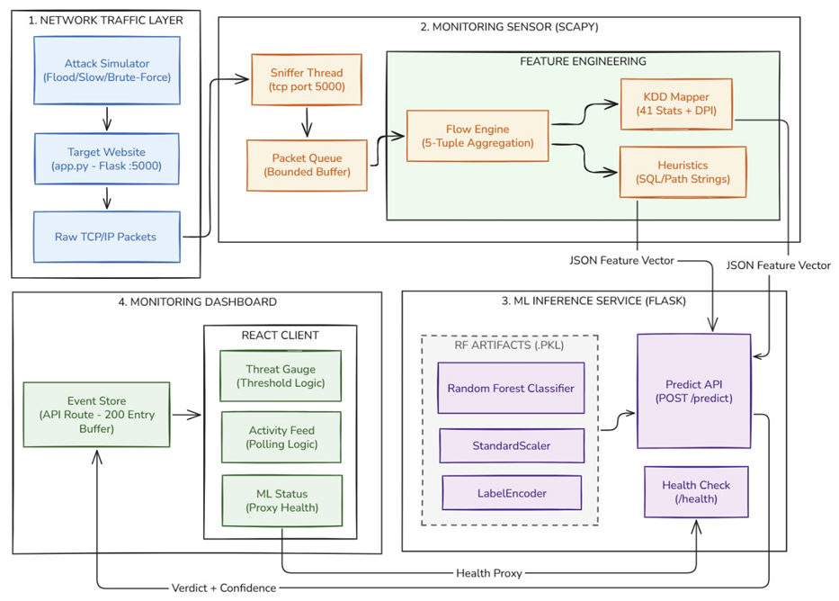

# 🛡️ ML Cyber Attack Prediction System

## 📺 Video Tutorial
**[Watch the Complete Video Tutorial on YouTube](https://youtu.be/3-mH1ynRf7U)** - Step-by-step guide for setting up and deploying the entire system.

## 🌟 Project Overview

The **ML Cyber Attack Prediction System** is a comprehensive, local solution for real-time network traffic analysis and cyber attack detection using machine learning. This system combines Random Forest classification with live deep packet inspection to provide robust network security monitoring, immediate threat prediction, and audible alerting capabilities.



### 🎯 Key Features

- **Real-time Network Monitoring**: Captures and analyzes live network traffic flows via a Scapy-based monitoring agent.
- **Machine Learning Detection**: Uses a trained **Random Forest** model on KDD-style metrics to classify benign vs. malicious traffic.
- **Intelligent Payload Decoding**: Unpacks URL-encodings to run Deep Packet Inspection (DPI) signatures against SQL Injection, Path Traversal, and Brute Force attacks.
- **Web Dashboard**: Modern **Next.js** glassmorphism interface for visualizing threats.
- **Active Alerting**: Triggers real-time visual toast notifications and **audible alarms** via the Web Audio API on attack detection.

---

## 📁 Project Structure

```text
CyberAttackPrediction/
├── target_website/
│   ├── app.py                  # Flask demo web application (port 5000)
│   └── simulate_attack.py      # Generates DDoS, SQLi, Port Scan, Brute Force traffic
│
├── ml_service/
│   ├── ml_ec2_service.py       # Flask ML prediction API (port 8080)
│   ├── train_rf_model.py       # Random Forest model trainer script
│   ├── config.py               # ML Configuration
│   ├── requirements.txt
│   └── rf_artifacts/           # Saved Model Binaries
│       ├── rf_model.pkl
│       ├── scaler.pkl
│       └── label_encoder.pkl
│
└── monitor_app/
    ├── app/                    # Next.js Dashboard UI (port 3000)
    │   ├── page.tsx            # Main Web UI + Alert Sound System
    │   ├── globals.css         # Animations & UI tokens
    │   └── api/                # Dashboard internal REST APIs
    └── network_agent/          
        ├── network_monitor_agent.py  # Python Scapy packet sniffer
        └── requirements.txt
```

---

## 🔄 System Workflow

```text
[Target Website :5000]  ←── normal/attack traffic ───  [simulate_attack.py]
         │
         ▼
[network_agent (Scapy)] ── packet capture + DPI heuristic feature extraction
         │
         ▼  HTTP POST
[ML Service :8080]  ── StandardScaler → Random Forest predict → return threat %
         │
         ▼
[Monitor App :3000]  ── display live tracking, play alarm, push toast notifications
```

---

## 🌐 Target Website (`target_website/app.py`)

A simple Flask web app running on **port 5000** that acts as the traffic target for the IDS to monitor.
```bash
cd target_website
pip install flask
python app.py
```

Browse to `http://localhost:5000` to generate normal traffic. Available API endpoints:
- `GET /api/users`
- `GET /api/products`
- `GET /api/transactions`
- `GET /api/health`
- `GET /api/search?q=<query>`
- `GET /api/login`

---

## 🚨 Attack Simulator (`simulate_attack.py`)

Generates 6 categories of attack traffic against `localhost:5000`:
```bash
python simulate_attack.py              # Run all attacks
python simulate_attack.py --type flood       # HTTP flood (DDoS-like)
python simulate_attack.py --type bruteforce  # Login brute force
python simulate_attack.py --type sqli        # SQL injection probing
python simulate_attack.py --type scan        # Port scan
python simulate_attack.py --type burst       # Rapid TCP burst
python simulate_attack.py --type slowloris   # Slow connection drain
```

---

## ⚙️ ML Service (`ml_service/`)

Flask REST API serving predictions on **port 8080**.

### Setup
```bash
cd ml_service
pip install -r requirements.txt
```

### Train models (Optional)
```bash
python train_rf_model.py       # Trains Random Forest from kdd_train.csv
```

### Run prediction server
```bash
python ml_ec2_service.py
```

---

## 🖥️ Monitor App (`monitor_app/`)

A **Next.js** dashboard that visualizes live predictions from the ML service and handles alarm states.

```bash
cd monitor_app
npm install
npm run dev        # http://localhost:3000
```
> **Note:** Once the dashboard opens, you must click anywhere on the interface at least once to authorize your browser to play the audio alerting system during an attack.

### Run Network Agent
In a separate terminal, to start snapping packets to evaluate:
```bash
python monitor_app/network_agent/network_monitor_agent.py
```

---

## 🛠️ Requirements
```text
Python 3.8+
Flask
scikit-learn
pandas, numpy
scapy (for network_agent)
joblib
Node.js 18+ (for Dashboard)
```

## 🔐 Security Considerations

- The traffic simulator `simulate_attack.py` generates suspicious payloads designed to test intrusion detection metrics.
- This project is for security learning, traffic analytics, and controlled testing only.
- Run attack simulation only in your own local/lab environment against authorized `localhost` targets.
- Do not use these scripts against unauthorized systems.
